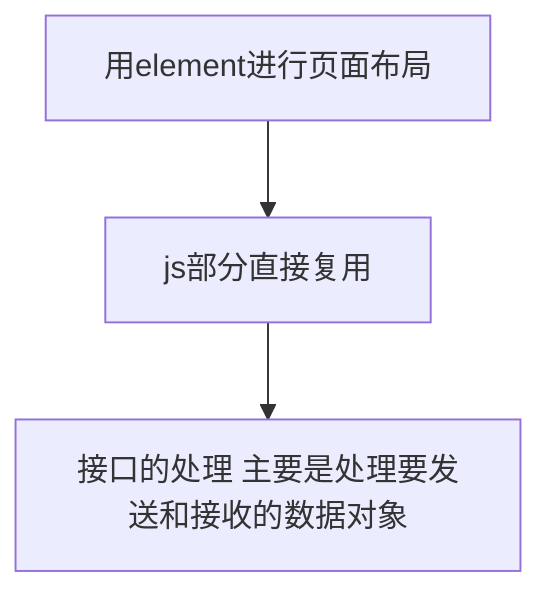

# 重庆电信模板

## 总模板

```html
@using Tideinfo.SmartIDC.Web.Components;
@{
ViewData["Title"] = "模板";
}
@section Header{
<style>
    .w200 {
        width: 200px;
    }

    .w566 {
        width: 566px;
    }

    .w257 {
        width: 257px;
    }

    .mt20 {
        margin-top: 20px;
    }

    .mr20 {
        margin-right: 20px;
    }

    .page {
        float: right;
        margin-top: 20px;
        margin-bottom: 20px;
    }

    .dialogTitle {
        margin-left: -50px;
        line-height: 24px;
        font-size: 18px;
        color: #303133;
    }

    .timeSelect.el-date-editor.el-input,
    .timeSelect.el-date-editor.el-input__inner {
        width: 200px;
    }
</style>
}
@section Breadcrumb{
<el-breadcrumb-item>@ViewData["title"]</el-breadcrumb-item>
}

<el-container>

    <el-header>

        <el-row>
            <el-button type="primary" class="el-icon-plus mr20" v-on:click="AE_openDialog('add',null)">
                添加
            </el-button>
            <el-input placeholder="请输入客户名称" class="w200 mr20" v-model="searchForm.name"></el-input>
            <el-input placeholder="请输入业务号码" clearable class="w257 mr20" v-model="searchForm.code">
                <el-button slot="append" icon="el-icon-search" v-on:click="getTable_checkTable_pagination(true)">
                </el-button>
            </el-input>
            <el-button type="primary" class="el-icon-back ">返回报表</el-button>
        </el-row>

    </el-header>

    <el-main>
        <el-table :data="tableData" style="width: 100%" border v-loading="tableLoading">
            <el-table-column prop="CustomerName" label="客户名称" align="center" show-overflow-tooltip>
            </el-table-column>
            <el-table-column prop="BusinessNumber" label="业务号码" align="center" show-overflow-tooltip>
            </el-table-column>
            <el-table-column prop="BusinessTimeBegin" label="业务开始时间" align="center" show-overflow-tooltip>
            </el-table-column>
            <el-table-column prop="BusinessTimeEnd" label="业务结束时间" align="center" show-overflow-tooltip>
            </el-table-column>
            <el-table-column label="管理" align="center" width="300">
                <template slot-scope="scope">
                    <el-button size="mini" type="primary" v-on:click="">分配端口
                    </el-button>
                    <el-button size="mini" type="primary" v-on:click="AE_openDialog('edit',scope.row)">修改
                    </el-button>
                    <el-button size="mini" type="danger" v-on:click="Delete(scope.row)">删除
                    </el-button>
                </template>
            </el-table-column>
        </el-table>
    </el-main>

    <el-footer>
        <el-pagination v-on:current-change="nextPage" :current-page="searchForm.currentPage"
            :page-size="searchForm.pageSize" layout="total, prev, pager, next, jumper" :total="searchForm.total"
            class="page">
        </el-pagination>
    </el-footer>
</el-container>


<!-- 添加和修改 弹窗 -->
<el-dialog :visible.sync="AE_dialog" width=1000px style="display:none" :close-on-click-modal=false>
    <!-- title  -->
    <div slot="title" class="dialogTitle" v-if="AE_isFlage=='add'">
                    <span>新增</span>
                </div>
    <div slot="title" class="dialogTitle" v-else-if="AE_isFlage=='edit'">
                    <span>编辑</span>
                </div>
    <!-- main -->
    <div id="dialog_main">
        <el-form :model="AE_form" :inline="true" ref="AE_form" label-width="150px" style="position:relative;left:68px;">
            <el-form-item label="客户名称">
                <el-input v-model="AE_form.name" class="w200" placeholder="请输入客户名称"></el-input>
            </el-form-item>
            <el-form-item label="业务号码">
                <el-input v-model="AE_form.code" class="w200" placeholder="请输入业务号码"></el-input>
            </el-form-item>
            <el-form-item label="业务开始时间" prop="height">
                <el-date-picker v-model="AE_form.btime" type="date" placeholder="请选择业务开始时间" class="timeSelect"
                    value-format="yyyy-MM-dd">
                </el-date-picker>
            </el-form-item>
            <el-form-item label="业务结束时间">
                <el-date-picker v-model="AE_form.etime" type="date" placeholder="请选择业务结束时间" class="timeSelect"
                    value-format="yyyy-MM-dd">
                </el-date-picker>
            </el-form-item>
            <el-form-item label="保底流量">
                <el-input v-model="AE_form.lowflow" class="w200" placeholder="请输入保底流量"></el-input>
                <span>Mbps</span>
            </el-form-item>
            <br>
            <el-form-item label="描述信息">
                <el-input type="textarea" :rows="4" placeholder="请输入描述信息" v-model="AE_form.desc" class="w566" clearable>
            </el-form-item>
        </el-form>
    </div>
    <!-- footer -->
    <div id="dialog_button" class="mt20">
        <span slot="footer" class="dialog-footer">
            <el-button v-on:click="AE_dialog = false">返回</el-button>
            <el-button type="primary" v-on:click="AE_submit()" v-if="AE_isFlage=='add'">提交</el-button>
            <el-button type="primary" v-on:click="AE_submit()" v-else-if="AE_isFlage=='edit'">提交</el-button>
        </span>
    </div>

</el-dialog>

@section Scripts{
<script>
    new Vue({
        el: "#main",
        data: createAppData({
            tableLoading: false,
            searchForm: {//搜索 表格
                pageSize: 10,
                pageIndex: 1,
                currentPage: 1, //当前页
                total: null, //数据总数
            },
            tableData: [],
            AE_form: {//新增修改表格
            },
            AE_dialog: false, //弹窗
            AE_isFlage: null,

        }),

        methods: {
            Delete: function (row) { //删除功能
                let self = this;
                self.$confirm('此操作将删除设备【' + row.CustomerName + '】, 是否继续?', '提示', {
                        confirmButtonText: '确定',
                        cancelButtonText: '取消',
                        type: 'warning'
                    })
                    .then(function () {
                        let url = baseUrl + "/report/DeleFlowReportCustomer";
                        let data = {
                            guid: row.GUID,
                        };
                        axios
                            .post(url, Qs.stringify(data))
                            .then(function (response) {
                                self.getTable_checkTable_pagination();
                                self.$message({
                                    showClose: true,
                                    message: '删除成功',
                                    type: 'success'
                                });
                            })
                    }).catch(function () {
                        self.$message({
                            type: 'info',
                            message: '已取消删除'
                        })
                    });
            },
            AE_openDialog: function (AE_isFlage, row) { //添加和修改弹窗
                let self = this;
                self.AE_isFlage = AE_isFlage;
                if (AE_isFlage === 'edit') { //修改
                    self.AE_form = {
                        guid: row.GUID, //传0为新增，大于0为更新
                    };

                } else if (AE_isFlage === 'add') { //新增 清空
                    self.AE_form = {
                        guid: null, //传0为新增，大于0为更新
                    };

                }
                self.AE_dialog = true;
            },
            AE_submit: function () { // 新增和修改提交
                let self = this;
                if (!self.AE_form.name) { //验证不通过 进行提示
                    self.$message({
                        showClose: true,
                        message: '请输入客户名',
                        type: 'error'
                    });
                    return false;
                }
                if (!self.AE_form.code) {
                    self.$message({
                        showClose: true,
                        message: '请输入业务号码',
                        type: 'error'
                    });
                    return false;
                }
                if (!self.AE_form.desc) {
                    self.$message({
                        showClose: true,
                        message: '请输入描述',
                        type: 'error'
                    });
                    return false;
                }
                if (self.AE_isFlage == 'add') { //添加
                    let url = baseUrl + "/report/AddUpdaFlowReportCustomer";
                    let data = {
                        guid: "", //传0为新增，大于0为更新
                        name: self.AE_form.name, //客户名
                        code: self.AE_form.code, //业务号码
                        btime: self.AE_form.btime, //开始时间
                        etime: self.AE_form.etime, //结束时间
                        lowflow: self.AE_form.lowflow, //保底流量
                        desc: self.AE_form.desc, //描述
                    };
                    let msg = "新增"; //提示文字
                    self.AE_public(url, data, msg); //调用公共函数
                    return false;
                }
                if (self.AE_isFlage == 'edit') {
                    //通过验证 发送请求
                    let url = baseUrl + "/report/AddUpdaFlowReportCustomer";
                    let data = {
                        guid: self.AE_form.guid, //传0为新增，大于0为更新
                    };
                    let msg = "修改"; //提示文字
                    self.AE_public(url, data, msg); //调用公共函数
                    return false;
                }
            },
            AE_public: function (url, data, msg) { //新增和修改的函数 公用部分
                let self = this;
                axios
                    .post(url, Qs.stringify(data))
                    .then(function (response) {
                        self.getTable_checkTable_pagination(); //再次请求表格数据
                        self.AE_dialog = false; //关闭弹窗
                        self.$message({ //新增成功的提示
                            showClose: true,
                            message: '' + msg + '政企客户'+'成功',
                            type: 'success'
                        });
                    })
                    .catch(function (error) {
                        self.$message({ //新增失败的提示
                            showClose: true,
                            message: '' + msg + '政企客户'+'失败',
                            type: 'error'
                        });
                    })
            },
            getTable_checkTable_pagination: function (check) { //1.获取表格数据 2.查询
                let self = this;
                let url = baseUrl + "/report/GetFlowReportCustomer";
                if (check) { //点击查询
                    self.searchForm.pageIndex = 1; //查询输入值时 pageindex赋值为1
                }
                let data = {
                    pageIndex: self.searchForm.pageIndex,
                    pageSize: self.searchForm.pageSize,

                };
                self.tableLoading = true;
                axios
                    .post(url, Qs.stringify(data))
                    .then(function (response) {
                        self.searchForm.total = response.data.totalRecords;
                        self.tableData = response.data.records;
                        self.tableLoading = false;
                    })
            },
            nextPage: function (row) { //后端分页
                let self = this;
                self.searchForm.pageIndex = row; //index传值
                self.getTable_checkTable_pagination();
            },


        },
      


        //页面加载执行
        created: function () {
            let self = this;
            self.getTable_checkTable_pagination();
        },
    })
</script>
}
```

## 导出按钮

```html
<el-button type="success" plain class="el-icon-download
">导出</el-button>

```

## 常用开关样式

```css
.switchBtn .el-radio-button__orig-radio:checked+.el-radio-button__inner {
    width: 109px;
}

.switchBtn .el-radio-button__inner {
    width: 109px;
}
//改变css
```


```
 <el-radio-group v-model="TreeOrtable" class="switchBtn">
        <el-radio-button label="树形"></el-radio-button>
        <el-radio-button label="列表"></el-radio-button>
    </el-radio-group>
    
    //单选框里面
    
    	
    
```

## 注释文本域

```
<el-input type="textarea" v-model="" class="w600" :rows="5" clearable></el-input>
```

## 开关状态点击时不改变状态

```JavaScript
<el-table-column label="状态" align="center" show-overflow-tooltip>
<template slot-scope="scope">
<el-switch v-model="scope.row.Status" :width="56" active-text="ON" inactive-text="OFF"
class="switchLayoutTwo"   v-on:change="changeStatus(scope.row)"  active-value="true"
inactive-value="false">
</el-switch>
</template>
</el-table-column>
//html部分


//函数部分
changeStatus: function (row) {//改变启用停用状态
let self = this;
row.Status =row.Status == 'true'?'false':'true'
if (row.Status == 'false') {
let openOrclose = "启用";
let data = {
flag: 1,
id: row.Id,
};
self.publicStatus(openOrclose, row, data);
}
else if (row.Status == 'true') {
let openOrclose = "关闭";
let data = {
flag: 0,
id: row.Id,
};
self.publicStatus(openOrclose, row, data);
}
},


publicStatus: function (openOrclose, row, data) {//公有改变状态函数部分
let self = this;
self.$confirm('此操作将' + openOrclose + '设备【' + row.RuleName + '】, 是否继续?', '提示', {
confirmButtonText: '确定',
cancelButtonText: '取消',
type: 'warning'
})
.then(function () {
let url = baseUrl + "/WarningRule/ChangeStatus";
axios
.post(url, Qs.stringify(data))
.then(function (response) {
self.getOrCheck();//再次请求表格数据
self.$message({//删除成功的提示
type: 'success',
message: '' + openOrclose + '成功!'
})
})
}).catch(function () {
self.$message({
type: 'info',
message: '已取消' + openOrclose + ''
});
});
},
```


# JS

 ## 数组

### forEach

### fliter

### find

### 对象外面嵌套数组

```javascript
let obj = {a:1,b:2}; 
let newobj = Object.keys(obj);//转对象
let arrobj= [newobj];//套数组
```

[参考网站](https://blog.csdn.net/weixin_38098192/article/details/80305961)

### 数组concat的用法

```javascript
self.checkData = JSON.parse(JSON.stringify(self.checkData.concat(odata))); //取消双向绑定
```

### 数组push

```
//本身就是返回值 不用接受
newArr.push(arr[i].name)
```

### 数组去重并找到下标

```JavaScript
var ary = new Array("1", "11", "33", "33");

 for (var i = ary.length-1; i >= 0; i--) {
     if (ary.indexOf(ary[i]) != ary.lastIndexOf(ary[i])) {
         console.log("下标为："+i);
         console.log("数组中有重复元素：" + ary[i]);
     }
 }   

//下标为：3
//数组中有重复元素：33
//下标为：2
//数组中有重复元素：33

```

[参考](https://blog.csdn.net/ann295258232/article/details/84940715)

### 数组去重

```JavaScript
unique: function (arr) {//去重
for (var i = 0; i < arr.length; i++) {
for (var j = i + 1; j < arr.length; j++) {
if (arr[i] == arr[j]) { //第一个等同于第二个，splice方法删除第二个
arr.splice(j, 1);
j--;
}
}
}
return arr;
},
```

### 计算数组中重复出现元素的个数

```JavaScript
 //统计一个数组中有多少个不重复的单词：
    // 不用reduce时： 
    var arr = ["apple","orange","apple","orange","pear","orange"]; 
    function getWordCnt(){ 
        var obj = {}; 
        for(var i= 0, l = arr.length; i< l; i++){ 
            var item = arr[i]; 
            obj[item] = (obj[item] +1 ) || 1; 
        } 
        return obj; 
    }
    console.log(getWordCnt());//{apple: 2, orange: 3, pear: 1}

	//推荐使用 简单
    // 用reduce时： 
    var arr = ["apple","orange","apple","orange","pear","orange"]; 
    function getWordCnt(){ 
        return arr.reduce(function(prev,next){ 
            prev[next] = (prev[next] + 1) || 1; 
            return prev; 
        },{}); 
    } 
    console.log(getWordCnt());//{apple: 2, orange: 3, pear: 1}

```

[参考网站](https://blog.csdn.net/muzidigbig/article/details/84175672)

### 批量替换数据（1替换为机房）

```JavaScript
function getName(type) {//封装方法
    var data = {//要转换数据的对应
        "1": '机房',
        "2": '节点',
        "3": '组件'
    }
    return data[type] ? data[type] : data['dog'];
};


let data = ["1", "3"]//要处理的数据
for (let i in data) {//遍历并调用
    console.log("test", self.getName(data[i]));
}
```

### push字符串格式

```JavaScript
oarr.push(odata[i].statist_list_id+"");
```

### 过滤空字符串和null和false

```
function bouncer(arr) {
  // Don't show a false ID to this bouncer.
  return arr.filter(function(val){
    return !(!val || val === "");
  });
}

bouncer([7, "ate", "", false, 9]);
————————————————
版权声明：本文为CSDN博主「shelomi」的原创文章，遵循 CC 4.0 BY-SA 版权协议，转载请附上原文出处链接及本声明。
原文链接：https://blog.csdn.net/xue4345/article/details/73238253
```

### 数组是否重复

```JavaScript
getrepet: function (arr) {//是否有重复
    console.log("arr",arr);
    let self = this;
    let newArr = [];
    for (let i = 0; i < arr.length; i++) {
        newArr.push(arr[i].portName)
    }
    ary = newArr;
    console.log("ary",ary);

    for (var i = ary.length - 1; i >= 0; i--) {
        if (ary.indexOf(ary[i]) != ary.lastIndexOf(ary[i])) {
            console.log("下标为：" + i);
            console.log("数组中有重复元素：" + ary[i]);
            console.log("self.addI",self.addI);
            console.log("i",i);

            self.addI.push(i);
            return true
        }else{
            return false
        }
    }
},
    //测试中
```


## 对象

### 两个对象合并

```JavaScript
var o1 = { a: 1 };
var o2 = { b: 2 };
var o3 = { c: 3 };

var obj = Object.assign(o1, o2, o3);
console.log(obj); // { a: 1, b: 2, c: 3 }
console.log(o1);  // { a: 1, b: 2, c: 3 }, 注意目标对象自身也会改变。
```

[参考网站](https://segmentfault.com/q/1010000005018933)

### 对象的键作为变量 需要用[]

```

```

### 按属性值排序JavaScript对象

```JavaScript
var list = {"you": 100, "me": 75, "foo": 116, "bar": 15};
keysSorted = Object.keys(list).sort(function(a,b){return list[a]-list[b]})
console.log(keysSorted);     // bar,me,you,foo

//list[a]-list[b] 从小到大排序
//list[b]-list[a] 从大到小排序
```

[参考网站](https://www.itranslater.com/qa/details/2106350071041229824)

### js取对象中的键与值

```
const data = {
  one: 'first',
  two: 'second',
  three: 'third'
}
 
for (var i in data) {
  console.log('键：' + i)
  console.log('值：' + data[i])
}

结果
键:one
值:first
键:two
值:second
键:three
值:third
```

### 遍历对象然后合并

```JavaScript
for(let k=0;k<res[0].length;k++){
avg= Object.assign(res[0][0],res[0][k]);
}

要把res[0][0]  初始数据带上 不然不生效
```


## json

### json替换键的名称（最好用）

+ 方法1

```JavaScript
nodes = JSON.parse(JSON.stringify(nodes).replace(/id/g, 'key'))//替换字段 id是原有的名字 key是要赋的值
//数组本身不会被替换 只会返回一个替换后的值 
//原理是将json转换为字符串 用replace统一替换字符串相同内容 然后返回的处理后的值赋给一个新变量
//可以用nodes来接收nodes返回的值 适应场景是nodes原本的值不会在用到 不然的话还是建议用新变量接收返回值
```

+ 方法2

```javascript
//原数据
var array = [
    {
        id:1,
        name:"小明"
    },
    {
        id:2,
        name:"小红"
    }
];
//修改后
var array = [
    {
        value:1,
        label:"小明"
    },
    {
        value:2,
        label:"小红"
    }
];
//
var result = array.map(o=>{return{value:o.id, label:o.name}});
console.log(result);
```

[参考网站](https://segmentfault.com/q/1010000015794387)

### 处理json中的空数据

```javascript
getTreeData: function (data) {
    let self = this;
    // 循环遍历json数据
    for (var i = 0; i < data.length; i++) {
        if (data[i].children.length < 1) {// children若为空数组，则将children设为undefined
            data[i].children = undefined;
        } else {// children若不为空数组，则继续 递归调用 本方法
            self.getTreeData(data[i].children);
        }
    }
    return data;
},
```

### 凑json数据

```JavaScript
<!-- 凑json 好用 -->
    //未测试
    row.forEach(element => {
    self.ids.push({
        groupid: self.layoutID,
        targetid: element.id
    });
})

//未测试
let groupid = "";
row.forEach(element => {
    self.ids.push({
        groupid: groupid,
        targetid: element.id
    });
})
let data = {
    "groupid": "123",
    "targetid": self.ids
}
console.log("data", JSON.stringify(data));
console.log("data", JSON.parse(JSON.stringify(data)));

```

### json中取出最大值（最小值）及其序号

```JavaScript
var a = [//要处理的json
    { "sid": 11478, "floor": 1, "x": 14, "y": 78, "points": 5463 },
    { "sid": 13256, "floor": 1, "x": 32, "y": 56, "points": 9463 },
    { "sid": 24765, "floor": 1, "x": 47, "y": 65, "points": 3256 },
    { "sid": 48352, "floor": 1, "x": 83, "y": 52, "points": 7946 },
    { "sid": 28643, "floor": 1, "x": 86, "y": 43, "points": 6492 }
]

let temp = a[0];//temp从第一位开始查
let obj = {};//接收成新对象
for (let i = 0; i < a.length; i++) {
    if (a[i].points > temp.points) {//points 要处理的键名
        temp = a[i];
        obj = { data: temp.points, index: i };
    }
}
console.log(obj);
```

## 

## 字符串

### js去掉字符串的空格回车换行

```JavaScript
//例如下面这个json串，中间的\n表示换行

var str = "{'   retmsg':'success   ',\n'  trans_date':'   20170906'}";
console.log(str);
//"{'   retmsg':'success   ',
//'  trans_date':'   20170906'}"


//去掉空格
str = str.replace(/\ +/g,"");   
console.log(str);
//"{'retmsg':'success',
//'trans_date':'20170906'}"


//去掉回车换行        
str = str.replace(/[\r\n]/g,"");        
console.log(str);
//"{'retmsg':'success','trans_date':'20170906'}"

```

[参考网站](https://blog.csdn.net/xiejunna/article/details/77879324)

## 对象数组

### JavaScript 对象数组，如何筛选出有相同key的对象

[参考网站](https://segmentfault.com/q/1010000019610692)

### 数组对象根据某个属性取出重复的个数

[参考网站](https://www.cnblogs.com/wgl0126/p/11596956.html)


## 对象、数组和json(数组对象)的区别

```javascript
let arr = [1,2,3,4,5];//数组
let obj = {a:1,b:2,c:3,d:4,e:5};//对象
let test = [{ a: 1, b: 3 },{ a: 1, b: 3 },];//数组中可以包含对象 一样可以通过 . 来获取到属性的值

//json标准格式 后台返回的数据样式 
//前后端交互的一种数据形式手段
//标准形式如下
{
    "status": "0",
        "message": "success",
            "data": {
                "title": {
                    "id": "001",
                        "name" : "test"
                },
                    "content": [
                        {
                            "id": "001",
                            "value":"hello 001"
                        },
                        {
                            "id": "002",
                            "value":"hello 002"
                        }
                    ]
            }
}

```


## 数组、字符串和对象相互转换

### 字符串转对象

+ 非标准json  eval （通用 推荐）

```JavaScript
let str = '{"name":"小明","age":18}';
let data= strToJson(jsObj)//调用

function strToJson(str) {//封装转换函数
    let json = eval('(' + str + ')');
    return json;
}
```

+ 标准json格式 用SON.parse()

```javascript
let str = '{"name":"小明","age":18}';
let json = JSON.parse(str);

//str的属性name和age  属性和属性值都用双引号引住(使用单引号来套双引号，如果反过来写报错)
```

[参考网站](https://blog.csdn.net/weixin_41646716/article/details/80939466)

### 字符串转数组

```JavaScript
var string = '123,456,789';//, 分割
var stringResult = string.split(',');
console.log(stringResult) //输出[123,456,789]
```

```JavaScript
var string2 = 'abcdef'//没有分割
var string2Result = string2.split('')
console.log(string2Result) //输出['a','b','c','d','e','f']
```

### 数组转字符串

```JavaScript
var array = ['abc', 'def', 'hig']
var arrayResult = array.join(',')
console.log(arrayResult) // 输出"abc,def,hig"
```

## URL的操作

### 跳转URL

```JavaScript
 window.location.href = "CopySumGraph?graphid=" + this.graphid;
//不打开新页面
```

```JavaScript
var url = "/Figure/ShowGraph?graphid=" + row.ID;
 window.open(url);
 //打开新页面
```

### 获取url参数名的值

```JavaScript
getQueryString:function(name) { //name是要求的参数名 返回的是对应的参数值
    let reg = new RegExp("(^|&)" + name + "=([^&]*)(&|$)", "i");
    let r = window.location.search.substr(1).match(reg);
    if (r != null) {
        return unescape(r[2]);
    };
    return null;
}

let data = "name"
let arr = this.getQueryString(data)

```

### 拼接URL参数

```javascript
var baseUrl = 'www.google.com';
var a = 1, b = 'request', c = true;

var finalUrl = baseUrl + '?a=' + a + '&b=' + b + '&c=' + c;//1.es5写法   + 号拼接法 不优雅
const finalUrl = `${baseUrl}?a=${a}&b=${b}&c=${c}`;//2. es6 字符串模板
```

[参考网站](https://blog.csdn.net/sjn0503/article/details/74936613)

### 判断url是否存在某个参数

```JavaScript
const params = new URLSearchParams(location.search.replace(/\?/ig, "")); //只需要一句话 location.search = "?name=young&sex=male"
params.has("young"); // true
params.get("sex"); // "male"
//存在就是true 不存在就是false

```

## moment的使用

[实例](https://www.jianshu.com/p/7364e42f707a)

### moment格式化时间

```JavaScript
moment(data).format('YYYY/MM/DD hh:mm:ss'); //data是要处理的数据 format里面是转换为的时间格式
```

### 获取当前时间及之前的24小时

```JavaScript
let startTimeCpu= moment().subtract(1, 'days').format('YYYY-MM-DD hh:mm:ss'); //前24小时
let endTimeCpu= moment().format('YYYY-MM-DD hh:mm:ss');//现在时间
```

### 10位时间戳转换为24进制时间

```JavaScript
odata.Time= new Date(parseInt(odata.Time) * 1000);
odata.Time = moment(odata.Time).format('YYYY-MM-DD HH:mm:ss')

//还是用到了moment
```

[参考网站](http://blog.sina.com.cn/s/blog_9cd4d4510102vto7.html)

### 比较两个时间的大小

```JavaScript
 moment('2019-11-01').isBefore('2019-11-16', 'day')
//可以把这里的day改为month或者year,那么相应的对比的就是月跟年的先后顺序

```

### 获取上一个月第一天和最后一天

```JavaScript
let a =  moment().month(moment().month() - 1).startOf('month').format('YYYY-MM-DD 00:00:00') ; //上个月第一天
let b =  moment().month(moment().month() - 1).endOf('month').format('YYYY-MM-DD 23:59:59')//上个月最后一天
```

[参考网站](https://www.jianshu.com/p/6949aa6708d8)

## axios的操作

### axios get请求

```JavaScript
axios.get('GetGraphImageList', {
    params: {
        "graphid": 3,
        "isShow": 1
    }
})
    .then(function (response) {
    console.log(response);
})
    .catch(function (error) {
    console.log(error);
});
//GetGraphImageList 是请求地址
//params 这一块对象 都是要发送的参数
```

### axios返回erro处理

```JavaScript
.catch(function (error) {
    self.$message({
        message: error,
        type: 'error'
    })
    self.loading = false;
});

```

### axios不换行写法

```JavaScript
   		let url = baseUrl + "";//请求地址
        let data = self.dialogForm_AE;//发送的数据
        axios.post(url, data).then(function (response) {
        })

```

## 常用的验证

### 邮箱验证

```JavaScript
var reg = /^[A-Za-z0-9\u4e00-\u9fa5]+@@[a-zA-Z0-9_-]+(\.[a-zA-Z0-9_-]+)+$/;//表达式

if (reg.test(self.selfPostFoem.inputEmails) == true) {//函数表达式
	
    
} else {
self.$message({ //失败的消息提示
showClose: true,
message: '请输入正确的邮箱地址',
type: 'error'
});
}
```

### IP地址校验

```JavaScript
function isValidIP(ip) {
    let reg = /^(\d{1,2}|1\d\d|2[0-4]\d|25[0-5])\.(\d{1,2}|1\d\d|2[0-4]\d|25[0-5])\.(\d{1,2}|1\d\d|2[0-4]\d|25[0-5])\.(\d{1,2}|1\d\d|2[0-4]\d|25[0-5])$/
    return reg.test(ip);
}
//调用
let a = isValidIP('1.1.1.10')
console.log(a)//a的值是true和false true通过 false不通过
```


# VUE

##  :class写三元表达式

```css
:class="followed ? 'btn-success':'btn-secondary'"

:class="scope.row.checkLeaveResultStr=='已批准' ? 'span_green':'span_red'"
```

[参考网站](https://segmentfault.com/q/1010000009092411)

## 万物皆可v-for

```javascript
<p v-for="(user,i) in listObj">我的id是 <span v-text="user.id"></span>   我的姓名是   <span v-text="user.name"></span> </p>

data: {
    listObj: [
        { id: 1, name: 'zs1' },
        { id: 2, name: 'zs2' },
        { id: 3, name: 'zs3' },
        { id: 4, name: 'zs4' },
        { id: 5, name: 'zs5' },
        { id: 6, name: 'zs6' },
    ]
},
    
    //v-for比想象的还要强大
```

## v-for实际应用

```javascript
<div v-for="item in vendorleftDown">//在div父级遍历 内部可以直接使用
    <span v-text="item"></span>//直接使用v-for遍历出的数据

<span style="float: right;" >
    <span>{{vendornumLeftDown[item]}}</span>/<span v-text="mainTableDataNoChange.length"> </span>
</span>

<el-progress :stroke-width="20" :percentage="(vendornumLeftDown[item])/(mainTableDataNoChange.length)*100" :show-text="false" :color="customColors">
    </el-progress>
</div>
//在div父级遍历 内部可以直接使用
//直接使用v-for遍历出的数据
//加了： 就可以直接做加减乘除运算
```


## vue只赋值不双向绑定

```JavaScript
 <input :value="something" >
 //将v-model 改为 :value 即可 原有的something不变
```

```JavaScript
temp = { 'data' : 'test' }; // 全局变量
// 这样改变obj的值的时候，temp的值不会跟随改变
let obj = JSON.parse(JSON.stringify(this.temp));
//待测试
```

[参考网站](https://segmentfault.com/q/1010000009785596)

## {{}} 三元运算符多次判断

```JavaScript
<template slot-scope="scope">
    {{scope.row.TypeGroup==1?"FTP服务连接响应":scope.row.TypeGroup==2?"POP3连接响应":scope.row.TypeGroup==3?"SMTP连接响应":scope.row.TypeGroup==4?"数据库连接响应":scope.row.TypeGroup==5?"定制服务连接响应":scope.row.TypeGroup==6?"WWW服务连接响应":"其它"}}
</template>
```

## vue的data中赋值为空 可能会出现无法输入的问题

```
obj.name="小强"
obj={
	name："小强"
}

这两种写法完全不同
```

## watch的使用

```
testOption: {
handler: function (val, oldval) {
console.log(val)
echarts.init(document.getElementById('main')).setOption(val);
},
deep: true //对象内部的属性监听，也叫深度监听

},
//对象的话 必须深度监听 不然获取不到

```

[参考网站](https://blog.csdn.net/itKingOne/article/details/69568498)


# element

## 布局（行布局）

```css
    .w200 {
      width: 200px;
    }
    .w257 {
      width: 257px;
    }
    .mr10{
      margin-right: 10px;
    }
```


```html
 <el-row >
          <el-button type="primary" class="mr10 el-icon-plus">新增</el-button>
          <el-input v-model="searchForm.a" placeholder="请输入内容" class="w200 mr10"></el-input>
          <el-input v-model="searchForm.b" placeholder="请输入内容" class="w200 mr10"></el-input>
          <el-input v-model="searchForm.c" placeholder="请输入内容" class="w200 mr10"></el-input>
          <el-input v-model="searchForm.d" placeholder="请输入内容" class="w257 mr10">
            <el-button slot="append"  class="mr10 el-icon-search"></el-button>
          </el-input>
        </el-row>
```

+  <el-row >结合 <el-col>并不好用  做不到精确布局  稍微不对称的布局就有问题  所以只用了 <el-row >
+  <el-input>必须给宽度 否则每一个<el-input>都会独立占据一行
+  class是语义化命名 通俗易懂
+  两个<el-input>之间有空格 会在页面上产生距离

## 布局容器（整体）

```html
<el-container>
  <el-header>Header</el-header>
  <el-main>Main</el-main>
  <el-footer>Footer</el-footer>
</el-container>
```

+ 强制使用 会让布局更轻松有序
+ 需要用到的时候就去官网复制粘贴
+ 高度是没有固定的 需要自己添加元素来撑开高度
+ 一般来说 页面的高度是不定的 宽度是固定的 浏览内容的扩展是从上往下的

## 表格

```html
  <el-table :data="tabelForm" border v-loading="loading">
          <el-table-column prop="name" label="a" align="center" show-overflow-tooltip>
          </el-table-column>
          <el-table-column prop="name" label="b" align="center" show-overflow-tooltip>
          </el-table-column>
          <el-table-column prop="name" label="c" align="center" show-overflow-tooltip>
          </el-table-column>
          <el-table-column prop="name" label="d" align="center" show-overflow-tooltip>
          </el-table-column>
          <el-table-column prop="name" label="e" align="center" show-overflow-tooltip>
          </el-table-column>
          <el-table-column label="操作" align="center">
            <template slot-scope="scope">
              <el-button size="mini" type="primary" v-on:click="Edit(scope.row)">编辑</el-button>
              <el-button size="mini" type="danger" v-on:click="Delete(scope.row)">删除</el-button>
            </template>
          </el-table-column>
        </el-table>
```

+ 表格需要加上border边框  
+ v-loading加载中  
+ align="center"内容居中  
+ show-overflow-tooltip内容过长隐藏
+ 可以用width="180"   来固定行宽

## 分页

```html
<el-pagination v-on:current-change="pageChange" :page-size="searchForm.pageSize" :total="searchForm.total"
               layout="total, prev, pager, next, jumper" class="elPage">
</el-pagination>
```

## 消息提示

```javascript
self.$message({//完成后的消息提示
    showClose: true,
    message: '成功',
    type: 'success'
});
```

## 开关 行内样式

```JavaScript
  <el-switch v-model="scope.row.monitor" :width="56" active-text="ON" inactive-text="OFF" class="switchLayoutTwo">
        </el-switch>
```

```css
  .switchLayoutTwo .el-switch__label--left {
        position: relative;
        left: 57px;
        color: #fff;
        z-index: -1;
        }
        .switchLayoutTwo .el-switch__label--right {
        position: relative;
        right: 56px;
        color: #fff;
        z-index: -1;
        }
        .switchLayoutTwo .el-switch__label.is-active {
        z-index: 2;
        color: #fff;
        }
```

## 多选框 默认选中

```JavaScript
//处理updata数据
let rowsnmp = self.rowSnmpData(row) //snmp处理后的数据
let rowUpdata = rowsnmp.settings.intf.update; //snmp updata处理后的数据
let isUpdata = rowUpdata == "255" ? true : false; //判断是否全选 赋值给snmp的data
self.checkedCities = self.rowsnmpNUM(rowUpdata) //处理updata 赋值
```

```JavaScript
//字符串转数组 后台传的数据是字符串才用
//处理snmp
rowSnmpData: function (row) {
    console.log("123", row);
    let json = eval('(' + row.snmpConfig + ')');
    return json;
},
```

```JavaScript
//按位或 解析值
// 处理snmp中的update
rowsnmpNUM: function (row) {
    let arr = ["1", "2", "4", "8", "16"]; //数组格式
    let newArr = [];
    let a1 = row;
    for (let i = 0; i < arr.length; i++) {
        newArr.push((arr[i] & a1) + '')
    }
    return newArr
},
```

## 表格 默认选中

```JavaScript
watch:{
    listPowerSupplyTab(n,o){
        this.$nextTick( ()=> { this.$refs.listPowerSupplyTab.toggleRowSelection(this.listPowerSupplyTab[0],true);
                             })
    },
},
     //原理是通过watch监控 操作表格的dom 给toggleRowSelection属性赋值为true
	 //如果有多个需要被选中的行 就需要通过遍历让对应的值得toggleRowSelection属性赋值为true
```

```JavaScript
<!-- 默认选中 json用foreach遍历  数组用let in遍历 -->
    self.$nextTick(function () {
    self.ruleTableData.forEach(function (ele, indexItem) {
        for (let j in stringResult) {
            let arr = stringResult[j];
            if (ele.id == arr) {
                self.$refs.ruleTableData.toggleRowSelection(ele);
            }
        }
    })
})
	//多个默认选中 通过遍历 是对应的id就赋值
	//toggleRowSelection接收的参数ele是一个对象 是选中行的数据
```

```JavaScript
toggleSelection(rows) {//封装的选择默认行的函数
    let self = this;
    if (rows) {
        rows.forEach(function(row) {
            self.$refs.multipleTable.toggleRowSelection(row);//默认选中行的数据
        });
    } else {
        self.$refs.multipleTable.clearSelection();
    }
},

    mounted: function () {
        let rows =[this.tableData[1],this.tableData[2]]//要选中行的数据
        this.toggleSelection(rows)//调用
    },
```

[参考网站](https://blog.csdn.net/xiongdaandxiaomi/article/details/83618744)

## 改变默认样式

```css
/* 自定义的btn属性要和el-button不留空格 因为它们是兄弟选择器 */
.btn.el-button {
    background-color: orange;
}
```


```JavaScript
//给要处理的element元素class 后面跟element样式

<el-button class="btn">默认按钮</el-button>

```

##  选择器获取vaule和label（通用）

```html
<!-- 关键在于 给el-option绑定原生的点击事件 并且传入item的值 -->
<el-select v-model="value" placeholder="请选择" >
            <el-option v-for="item in options" :key="item.value" :label="item.label" :value="item.value" v-on:click.native="btn(item)">
            </el-option>
</el-select>
```

```javascript
btn: function (row) {
    console.log("row",row.value)//获取到当前行的vaule值
    console.log("row",row.label);//获取到当前行的label值
}
```

[参考网站](https://segmentfault.com/q/1010000009693531)

## 选择器另一种写法

```JavaScript
//不使用v-for遍历数据生成 这种适合数据量少的情况 
//v-for和html硬写方式是可以互相转换的
<el-select v-model="addForm.usetype" placeholder="请选择IP用途" clearable class="widthPercentage">
        <el-option label="网关地址" value="1"></el-option>
        <el-option label="网络地址" value="2"></el-option>
        <el-option label="广播地址" value="3"></el-option>
        <el-option label="互联地址" value="4"></el-option>
</el-select>
```

## 根据条件显示table里的数据

```JavaScript
<el-table-column prop="source" label="来源" align="center" show-overflow-tooltip>
    <template slot-scope="scope">
        <span v-if="scope.row.source===0">本地资源
        </span>
    </template>
</el-table-column>

//v-if的判断结果来控制显示内容
```

## 上传类型限制

```JavaScript
<el-upload
   :action="uploadUrl"
   ref="upload"
   :multiple="false"
   :on-change="fileChange"
   :before-upload="beforeUpload"
   :on-success="handleAvatarSuccess"
   :on-preview="file_click"
   class="upload-demo"
   list-type="text"
   accept=".jpg,.jpeg,.png,.gif,.bmp,.pdf,.JPG,.JPEG,.PBG,.GIF,.BMP,.PDF"
   :file-list="uploadForm.personFileList"
   :auto-upload="false">
   <el-button size="small" type="primary">选择文件</el-button>
        <div slot="tip" class="el-upload__tip"><i class="el-icon-warning" style="color:red;margin-right:5px"></i>单个文件不超过5MB</div>
 </el-upload>

//accept=".jpg,.jpeg,.png,.gif,.bmp,.pdf,.JPG,.JPEG,.PBG,.GIF,.BMP,.PDF"  关键语句
```

[参考网站](https://blog.csdn.net/github_37847992/article/details/80390673)

## 表格跳转

```JavaScript
 <el-table-column label="域名">
        <template slot-scope="scope">
          <a :href="'http://'+scope.row.Address"
            target="_blank"
            class="buttonText">{{scope.row.Address}}</a>
        </template>
      </el-table-column>
//使用a标签
```

## 级联选择器获取vaule和label

```javascript
 //先给级联选择器ref=""重命一个新组件名为cascaderAddr
 //然后，使用this.$refs['新组件名'].currentLabels
     //this.$refs['新组件名'].currentLabels 在2.7版本给移除了 可以通过this.$refs['件名'].getCheckedNodes() 获取到选中的节点 

    console.log('666', this.$refs['cascaderAddr'].getCheckedNodes()[0].label)

    console.log("选择大会", this.$refs['cascaderAddr'].getCheckedNodes());
```

[参考网站](https://blog.csdn.net/lijiabinbbg/article/details/97396812)

## element表格动态生成表头

```JavaScript
<el-table :data="testData.dateli" border class="mt20">

<el-table-column  label="时间" prop="datastr" align="center" show-overflow-tooltip>
</el-table-column>

<el-table-column v-for="(item, index) in list" :key="index" :label="item.bunen" prop="qishu" align="center" show-overflow-tooltip>
</el-table-column>

<el-table-column  label="汇总" prop="qishu" align="center" show-overflow-tooltip>
</el-table-column>


</el-table>
```

[参考网站](https://blog.csdn.net/QQ_Empire/article/details/90552744?depth_1-utm_source=distribute.pc_relevant.none-task&utm_source=distribute.pc_relevant.none-task)

[参考网站](https://blog.csdn.net/yw00yw/article/details/86609332)

## element上传组件

```javascript
<el-upload :action="logoUrl" list-type="picture-card" :on-preview="handlePictureCardPreview"
:on-remove="handleRemove" :file-list="fileList" :limit="1" :on-exceed="handleExceed">
<i class="el-icon-plus"></i>
</el-upload>
<el-dialog :visible.sync="dialogVisible" :append-to-body="true">

</el-dialog>

//:action="logoUrl" 要上传的地址
//:file-list="fileList" 本地显示的图片
//:src="dialogImageUrl" 获取到的图片直接用
```

## element分页 当前页不生效解决方法

```JavaScript
:current-page.sync="currentPage"


//查询
searchData: function () {
var self = this;
self.currentPage = 1;//当前页重置为1
self.pageIndex = 1;//申请的序号处理为1
self.getRackList();
},

```

[参考网站](http://bugshouji.com/mybug3/t856)

## element-ui 遮罩层el-dialog 中间内容被被蒙板遮住 解决

```
:append-to-body="true"
```

[参考网站](https://blog.csdn.net/adley_app/article/details/84254727)

## element表格数据时间格式化（处理表格的数据通用）

```javascript
//初始格式：2019-11-21T00:00:00
  <el-table-column prop="selecttime" label="时间" align="center" :formatter="dateFormat"></el-table-column>
//重点是处理row 和 column的值
dateFormat(row, column) {
    var date = row[column.property];
    if (date == undefined) { return '' };
    return moment(date).format("YYYY-MM-DD HH:mm:ss")
}

//转换格式：2019-11-21 00:00:00
```

[参考网站](https://blog.csdn.net/x_lord/article/details/70225481)

## element时间范围组件获取时间写法

```JavaScript
SubmitTimeStart: self.searchForm.SubmitTime ? self.searchForm.SubmitTime[0] : "", // 发起申请开始时间
SubmitTimeEnd: self.searchForm.SubmitTime ? self.searchForm.SubmitTime[1] : "", //结束
VacationTimeStart: self.searchForm.VacationTime? self.searchForm.VacationTime[0] : "", // 请假开始时间
VacationTimeEnd: self.searchForm.VacationTime? self.searchForm.VacationTime[1] : "", // 结束
    
 //self.searchForm.SubmitTime是时间范围组件绑定的v-model  
//三元表达式来处理 有就赋值 没有就是空
```

## element表单类型验证

```JavaScript
//验证邮箱
//验证手机号
//都可以使用type
email: [{
    required: true,
    message: '请输入邮箱地址',
    trigger: 'blur'
},
        {
            type: 'email',
            message: '请输入正确的邮箱地址',
            trigger: ['blur', 'change']
        },
       ],

```

[参考网站](https://www.jianshu.com/p/d71dc34193b4)

## 表格保留两位小数

```JavaScript
<el-table-column
prop="address"
label="地址"
:formatter="formatter">
</el-table-column>

//表单处理
formatter(row, column) {
return row.address;
}

```

## 表单验证清空

```JavaScript
//在打开弹窗的方法里面调用

self.AE_dialog = true;
setTimeout(function(){
self.$refs.AE_form.clearValidate();
},100)

//ref 表单绑定的dom
//clearValidate() 调用这个方法可清空验证
//延时函数 等待弹窗加载完毕


```

## 动态生成表头 数据

```JavaScript
//重点数据 tableData
//tableHead
//:prop="item.column_name"唯一标志   :label="item.column_comment"表头   
<el-table style="width: 100%" border :data="tableData">
    <template v-for="(item,index) in tableHead">
        <el-table-column :prop="item.column_name" :label="item.column_comment" :key="index"
v-if="item.column_name != 'id'"></el-table-column>
</template>
</el-table>


//表头
data.dateli[0].portlist.forEach(function (i) {
self.tableHead.push({ column_comment: i.portname, column_name: i.portname })
});
//数据
let oData = [];
let obj = {};
data.dateli[0].portlist.forEach(function (i) {
let val = i.portname
obj[val]=i.text;
});
self.tableData.push(obj)

//表头是固定的两个参数 column_comment要显示的表头   column_name表头唯一标志
//obj 是表格数据  

//tableData 有多少组对象 就有多少行数据

```

```JavaScript
//javascript
// 表头数据
tableHead:[
    {
      column_name: "姓名",column_comment:"姓名"
    },
    {
      column_name: "年龄",column_comment:"年龄"
    },
    {
      column_name: "性别",column_comment:"性别"
    }
],
// 表格数据
tableData: [{
    年龄: '3',
    姓名: '鞠婧祎',
    性别: '女'
  },
  {
    年龄: '25',
    姓名: '魏大勋',
    性别: '男'
  },
  {
    年龄: '18',
    姓名: '关晓彤',
    性别: '女'
}],

优化后的写法 更简单
```

[参考](https://www.jianshu.com/p/9c4ba833658f?utm_campaign=maleskine&utm_content=note&utm_medium=seo_notes&utm_source=recommendation)

## 穿梭框不能放在表单里面 样式会错乱

## flex和element有冲突 不能用flex全局布局 局部可以

## element的多个表格可以合并在一起

```javascript
<el-table :data="tableData" border class="mt20" >        
<template v-for="(item,index) in tableHead">
<el-table-column :prop="item.column_name" :label="item.column_comment" :key="index" align="center"
show-overflow-tooltip></el-table-column>
</template>
</el-table>


<el-table :data="distableData" border class="disTable" >
<template v-for="(item,index) in tableHead">
<el-table-column :prop="item.column_name" :label="item.column_comment" :key="index" align="center"
show-overflow-tooltip></el-table-column>
</template>

</el-table>


.disTable.el-table thead {
display: none;
}
//隐藏掉第二个表格
```


# echarts使用

```html
//html部分 宽高都必须给
<div id="main" style="width: 600px;height:400px;"></div>

```

```
//定义在data中 好动态赋值
data: {
option: {
title: {
text: 'ECharts 入门示例'
},
tooltip: {},
legend: {
data: ['销量']
},
xAxis: {
data: ["衬衫", "羊毛衫", "雪纺衫", "裤子", "高跟鞋", "袜子"]
},
yAxis: {},
series: [{
name: '销量',
type: 'bar',
data: [5, 20, 36, 10, 10, 20]
}]
},

```

```JavaScript
//至少要在生命周期的mounted中才能引用
//echarts.init不用定义var变量接收 麻烦
//更新一次就得再加载一次
mounted: function () {
let self = this;
echarts.init(document.getElementById('main')).setOption(self.option);

},
```

```
watch: {
option: {
handler: function (val, oldval) {
console.log(val)
echarts.init(document.getElementById('main')).setOption(val);
},
deep: true //对象内部的属性监听，也叫深度监听

},
},
//监听echarts图的配置变化 把变化后的值赋值进去

```

# vcharts的使用

```
vcharts是基于echarts 两者的版本要一致
vcharts会在数据变化后自动更新 好用得很
vcharts的使用也方便的多 问题也少
vcharts引用是在echarts之后
vcharts的官网不能在连接外网时使用
不用监听 不用操作dom 爽 
```

```JavaScript
self.chartData.rows.push({ '日期': '1/1', '访问用户': 1393, '下单用户': 1093})
//可以用push的方式来赋值
//结合foreach
```

[vcharts官网](https://v-charts.js.org/#/data)

# CSS

## 下划线+鼠标滑过出现手指

```JavaScript
underline{
cursor: pointer;
text-decoration: none;
border-bottom: 1px solid #070000;
}
```

## 背景图片不随着操作有任何变化

```css
body {
    background-image: url("../images/bg-main.jpg");
    background-position: center center;
    background-size: cover;
    background-repeat: no-repeat;
    background-attachment: fixed;
}
```

## 子绝父相

```
//子盒子只能在父盒子内移动
```

[子盒子相对父盒子居中](https://blog.csdn.net/qq_41228218/article/details/95938902)

# github

## 在vscode中的使用

+ 下载
  + 在github中创建一个新的仓库
  + 复制    **.git地址**
  + 打开**本地文件夹**
  + 在vscode初始化仓库 
  + 添加远程仓库  输入：**origin**  再输入：  https://github.com/laozhangaidaima/gitTest.git
  + 等待2,3分钟后 选择 **拉取自...**     （还是不行就重启下vscode
+ 上传
  + 创建新文件 并修改
  + 源代码管理器 点击**保存**  输入 **提交备注**   
  + 点击 **推送到仓库**

+ 推送到新分支
  + 点击 **签出到**   建立**新的分支**    **直接输入新分支的名字**
  + 切换分支成功 上传方式同上
  + 改变提交的分支
  + 信息里面显示的 就是会默认被提交到的
  + vscode里面点击撤销 正在操作的文件就会被撤销
  + 当前分支没有待提交文件 才能推送新的分支
+ 分支合并
  + 暂时用不到 知道有这么回事就好
  + 提交


#  其他

## 用vscode格式化cshtml

```JavaScript
"files.associations": {
"*.cshtml": "html",
}

//放在配置文件settting.json中
//这一坨是生效的
```

```JavaScript
{
    "workbench.iconTheme": "vscode-icons",
    "workbench.colorTheme": "Material Theme High Contrast",
    "files.autoSave": "afterDelay",
    "editor.wordWrap": "on",
    "[html]": {
        "editor.defaultFormatter": "vscode.html-language-features"
    },
    "window.zoomLevel": 2,
    "liveServer.settings.donotShowInfoMsg": true,
    "vsicons.dontShowNewVersionMessage": true,
    "files.associations": {
        "*.cshtml": "html",
    },
    "[css]": {
        "editor.defaultFormatter": "esbenp.prettier-vscode"
    },
    "files.trimTrailingWhitespace": true,
    "workbench.sideBar.location": "left",
    "[javascript]": {
        "editor.defaultFormatter": "esbenp.prettier-vscode"
    },
    "editor.quickSuggestions": {
        "strings": true
    }
}
    //没测试 不知道是否生效
```


## 谷歌浏览器打断点

```
//代码复杂了 打断点没有console.log有用 
//打断点的好处是可以详细的看到代码执行过程 以及每一个变量的变化

```

[参考网站](https://web.blued.cn/2017/08/10/chrome%E8%AE%BE%E7%BD%AE%E6%96%AD%E7%82%B9%E7%9A%84%E5%90%84%E7%A7%8D%E5%A7%BF%E5%8A%BF/)

## 用Chrome开发并且同步文件

+ 神器 这样就不要打开vscode 直接面向Chrome编程 只是不支持快捷键和提醒 还是不方便
+ 只适合大体开发完成后 调试代码 不适合开发
+ 同步了一次  不移除就会一直同步 好处是方便 坏处是没有智能提示

[参考网站](https://blog.csdn.net/Tyro_java/article/details/51384156)

## XLSX 表格保存为Excel

```JavaScript
let wb = XLSX.utils.table_to_book(document.querySelector('#table'));   // 这里就是表格
let wbout = XLSX.write(wb, { bookType: 'xlsx', bookSST: true, type: 'array' });
try {
    FileSaver.saveAs(new Blob([wbout], { type: 'application/octet-stream' }), 'table.xlsx');  //table是自己导出文件时的命名，随意
} catch (e) {
    if (typeof console !== 'undefined')
        console.log(e, wbout)
}
return wbout
//没有测试过
```


## 清空多余行

```
^\s*(?=\r?$)\n
```

## 按位与（传值和解析值）

```javascript
//数组按位与出合并的值
let update = ["1", "2", "4", "8", "16"]; //要与的数组
let newupdate = update[0];//从数组的第一位开始与
for (var i = 0; i < update.length; i++) {
    newupdate = newupdate | update[i + 1];
}

//与出来的 newupdate 是一个数字
```

```javascript
//把与的结果解析
// 封装的函数
//row是要解析的值 就是多个字与出来的值
//处理后的结果是数组
rowsnmpNUM: function (row) {
    let arr = ["1", "2", "4", "8", "16"]; //数组格式
    let newArr = [];
    let a1 = row;
    for (let i = 0; i < arr.length; i++) {
        newArr.push((arr[i] & a1) + '')
    }
    return newArr
},
```

## es6兼容IE

```
不能用
箭头函数修改
函数加function
字符串模板不要用
```


## 前端模糊查询

```JavaScript
<!-- script部分 -->
 private mySearch(mainData, searchRules) {//封装的搜索函数
    let tableData = [];
    for (let key in searchRules) {
      if(searchRules[key]==null){
        searchRules[key]="";
      }
      tableData = [];
      for (let i = 0; i < mainData.length; i++) {
        if (mainData[i][key].indexOf(searchRules[key]) != -1) {
          tableData.push(mainData[i]);
        }
      }
      mainData = tableData;
    }
    return tableData;
  }


  <!-- data部分 -->
 private searchRules = {
    Time: "8",//需要mianData里的字段对应
    FileName: "",
    name:"",
  };
data=this.mySearch((mainData,searchRules )

//[{Time:"852},{Time:"82},{Time:"52},{Time:"8520},]
```

```JavaScript
//实例
//第一层 搜索功能数据
searchRules: {//data里面定义
    nodename: "",//需要mianData里的字段对应
    resname: "",
    resip: "",
},

//封装函数
mySearch: function (mainData, searchRules) {
    let tableData = [];
    for (let key in searchRules) {
        if (searchRules[key] == null) {
            searchRules[key] = "";
        }
        tableData = [];
        for (let i = 0; i < mainData.length; i++) {
            if (mainData[i][key].indexOf(searchRules[key]) != -1) {
                tableData.push(mainData[i]);
            }
        }
        mainData = tableData;
    }
    return tableData;
},
//第一层 搜索功能
getTargetList: function () {
    this.mainTableData = this.mainTableDataNoChange;
    var data = [];
    data = this.mySearch(this.mainTableData, this.searchRules);
    this.mainTableData = data;
},

```

## 前端分页+模糊查询

```JavaScript
<el-table :data="tables.slice((pageIndex-1)*pageSize,pageIndex*pageSize)"  style="width: 100%">// 前端分页关键
    
 
```

[参考网站](https://blog.csdn.net/xuxu_qkz/article/details/80908949)

## 多级循环嵌套（获取机房节点用过）

```JavaScript
loopTreeData: function (data, children) {
    for (let i = 0; i < data.length; i++) {

        if (data[i][children]) {
            if (data[i][children].length > 0) {

                loopTreeData(data[i][children], children);
            }
        }
    }
},


loopTreeData: function (data, children) {  //打印data 已经遍历出东西了 直接处理就好
        roomData = this.roomData;//获取room的数据
        roomData = JSON.parse(JSON.stringify(roomData).replace(/roomName/g, 'text'))//替换字段

        for (let i = 0; i < data.length; i++) {
            for (let k in roomData) { //遍历room 通过id配对
                if (data[i].id == roomData[k].nodeId) {
                    data[i].nodes = data[i].nodes.concat([roomData[k]]);
                }
            }
            if (data[i][children]) {
                if (data[i][children].length > 0) {
                    this.loopTreeData(data[i][children], children);
                }
            }
        }
    },

     //没测试
```

## 节点机房组件

```JavaScript
只包含节点
<node-selector v-model="rowData.NODENAME" :default-node="defaultConfig" v-on:node-change="nodeChange"
    :node-config="nodeConfig " :include-room="false" node-data-url="/Node/GetNode">
</node-selector>
<div>
    defaultConfig: {
    },
    //编辑 节点选择
    nodeChange: function (data) {
    // 编辑
    this.dataMsg.ID = data.node.id;
    this.dataMsg.FATHERID = data.node.fid;
    this.tableDataMain.NODENAME = data.node.text
    this.rowDataAdd.NODENAME = data.node.id;
    // 新增
    this.dataMsg2.NODEID = data.node.id;
    },
    nodeConfig: {
    props: {
    value: "id",
    label: 'text',
    children: 'nodes',
    },
    },
</div>

<!-- 节点 机房地址 -->
node-data-url="Node/GetNode" room-data-url="Room/GetAllRooms"

包含节点+机房
级联选择器+选择框 配置nodeConfig和roomConfig
改宽度.node-selector-copy .treeButton {
width: 272px;
}
<div>
    <!-- html -->
    <node-selector :include-room="true"  :node-config="nodeConfig"   :room-config="roomConfig"
        node-data-url="http://10.143.133.32:8080/v2/handler/GetResourceInfo.ashx?action=GetNode"
        room-data-url="http://10.143.133.32:8080/v2/handler/GetResourceInfo.ashx?action=GetRooms">
    </node-selector>
    <!-- data -->
    nodeConfig: {
    props: {
    value: "id"
    label: 'text',
    children: 'nodes',
    },
    },
    roomConfig: {
    props: {
    value: 'nodeId',
    label: 'roomName',
    },
    },
</div>


编辑功能中默认选择节点 机房
:default-node="defaultConfig"
<!-- data -->
defaultConfig: {
},
<!-- script -->
this.defaultConfig = {
nodeName: item.NodeName,
nodeId: item.Id,
};

完整 节点清空
<node-selector :include-room="true" :node-config="nodeConfig" :room-config="roomConfig"
    node-data-url="http://10.143.133.32:8080/v2/handler/GetResourceInfo.ashx?action=GetNode"
    room-data-url="http://10.143.133.32:8080/v2/handler/GetResourceInfo.ashx?action=GetRooms"
    v-on:change="nodeAndroomChange" :node-clearable="true" :default-node="defaultConfig" :default-room="defaultRoom">
</node-selector>

nodeConfig: {
props: {
value: "id",
label: 'text',
value: "id",
children: 'nodes',
},
},
roomConfig: {
props: {
value: 'roomId',
label: 'roomName',
},
},

<!-- 默认清空 -->
self.addDefaultConfig = {
nodeName: "",
nodeId: "",
};

<!-- 只有节点 需要nodeID和roomID -->
<!-- 有节点 有机房 就只需要nodeid -->
<!-- nodeid roomid的取值 -->
self.layoutNodeid = data.node.id;
self.layoutRoomid = data.room.roomId;

<!-- 清空room -->
<!-- 传 空格 -->
:default-room="secondDefaultroom"
secondDefaultroom:"",
self.secondDefaultroom = " ";


<!--  -->
<node-selector v-model="nodeOrRoom" :include-room="true" :node-config="nodeConfig" :room-config="roomConfig"
    node-data-url="/Node/GetNode" room-data-url="/Room/GetAllRooms" v-on:change="nodeAndroomChange"
    :node-clearable="true">
</node-selector>

<!-- 取出对应的nodeId roomId -->
// 机房节点组件
nodeOrRoom: function (row) {
    let self = this;
    console.log("row",row.node.id);
    console.log("row",row.room.roomId);


},


<!-- 带baseUrl -->
:node-data="nodeData"
:room-data="roomData"

nodeData:[],
roomData:[],
// 获取节点 url
getNodeData: function () {
    let self = this;
    let url = baseUrl + "/Node/GetNode";
    axios
        .post(url)
        .then(function (response) {
            self.nodeData = response.data.content.nodes;
        })
        .catch(function (error) {
        })
},

// 获取机房 url
getRoomData: function () {
    let self = this;
    let url = baseUrl + "/Room/GetAllRooms";
    axios
        .post(url)
        .then(function (response) {
            console.log("response",response);
            self.roomData = response.data.content;
        })
        .catch(function (error) {
        })
},


mounted: function () {

    self.getNodeData();
    self.getRoomData();

},
    
 //节点长度
.nodeCss .el-input--suffix .el-input__inner {
    width: 200px;
}
```

## 拼接

```JavaScript
let update = self.checkedCities; //处理采集接口属性
let newupdate = update[0];
for (var i = 0; i < update.length; i++) {
    newupdate = newupdate | update[i + 1];
}
let stat = self.datacheckedCities; //处理采集接口数据
let newstat = stat[0];
for (var i = 0; i < stat.length; i++) {
    newstat = newstat | stat[i + 1];
}
update = self.snmpData.update == true ? 255 : newupdate; //采集接口属性
stat = self.snmpData.stat == true ? 255 : newstat; //采集接口属性
```

## cshtml中写正则表达式 @写成@@

## 遍历两遍

```JavaScript
for (let i = 0; i < row.length; i++) {
for (let j = 0; j < array.length; j++) {
if (array[j].resId == row[i].DeviceID) {
row[i].resName= array[j].resName;
}

}

}
```

## 替换键名要用[ ]  对象数组内两个元素拼凑成键值对

```javascript
let self = this;

let data = {};
self.suportType.forEach(function (ele) {
    data[ele.int_SupportTypeId] = ele.vchr_SupportType;
})
console.log("data", data);

return data[type] ? data[type] : data['dog'];

//data的形式 {1: "test", 2: "123", 3: "142", 4: "333"}
//了解对象[]的

```

## 命令行登录5000

```
C:\Users\111\Desktop\IdentityServer-https\  

//敲这行代码
IdentityServer.exe --urls=https://localhost:5000

//在cmd里面输入以上命令
```

## if语句判断 数组的indexof

```JavaScript
if ([2, 28, 1].indexOf(row.businessStatus) > -1) { //客户使用
self.stateisenable = true;
//self.optionsStatus = [{ value: 2, label: '实占' }];
}

//if ([2, 28, 1].indexOf(row.businessStatus) > -1)
```


## return是谁调用返回谁

```JavaScript
axios
.post(url, Qs.stringify(data))
.then(function (response) {
isFlage = response.data == '' ? true : false; //true没有绑定
//    console.log("response",response.data=='');


})
return isFlage

//不能在axios内return
//axios是不能return的
```

## 能抄绝对不写

时间选择器 处理数据

```javascript
let data = {
pageIndex: 1,
pageSize: 10,

SubmitTimeStart: self.searchForm.SubmitTime ? self.searchForm.SubmitTime[0] : "", // 发起申请开始时间
SubmitTimeEnd: self.searchForm.SubmitTime ? self.searchForm.SubmitTime[1] : "", //结束
VacationTimeStart: self.searchForm.VacationTime? self.searchForm.VacationTime[0] : "", // 请假开始时间
VacationTimeEnd: self.searchForm.VacationTime? self.searchForm.VacationTime[1] : "", // 结束
UserName: self.searchForm.UserName, // 申请人
};

//用三元表达式 有值得话就赋值 没值得话就赋值为空
//三元表达式真香
```

## 表格里面的数据是数字的话，要保留两位小数，时间 yyyy-dd-mm 的格式

## 

```JavaScript
//data接收的是对象数组
<el-transfer v-model="portvalue" :data="portData"></el-transfer>

portData: [{
key: 1,
label: '黄金糕'
}, {
key: 2,
label: '双皮奶'
}, {
key: 3,
label: '蚵仔煎'
}, {
key: 4,
label: '龙须面'
}, {
key: 5,
label: '北京烤鸭'
}],

portvalue: [1, 4],
```

## js方法套方法（基于方法会有返回值）

```
this.numLeftDown = this.getWordCnt(this.getLeftDownData(this.leftDown,
'type')); //数据有多少个
```


## 报表类型对应不同时间日期选择器

```JavaScript
//html部分
<el-select v-model="dateType" class="w200 mr20" placeholder="请选择报表类型" v-on:change="DateTypeChange">
<el-option v-for="item in pctTypeForm" :key="item.key" :label="item.name" :value="item.key">
</el-option>
</el-select>

<el-date-picker v-model="dateVaue" :type="dateTypeBulid" :format="dateFormat" placeholder="选择日期"
v-show="dateShow"></el-date-picker>
<el-date-picker v-model="dateVaue" type="daterange" range-separator="-" start-placeholder="开始日期"
end-placeholder="结束日期" v-show="!dateShow"> </el-date-picker>


//data部分
dateType: "month",
dateTypeBulid: "month",
dateFormat: "",
dateShow: true,
dateVaue: "",


pctTypeForm: [{
name: "日报",
key: "date"
},
{
name: "周报",
key: "week"
},
{
name: "月报",
key: "month"
},
{
name: "年报",
key: "year"
},
{
name: "自定义时间",
key: "daterange"
},
],
//js部分
 //报表的选择
DateTypeChange: function () { //报表类型
console.log("66666");
this.dateVaue = "";
if (this.dateType == "daterange") {
this.dateShow = false;
} else {
this.dateShow = true;
this.dateTypeBulid = this.dateType;
}
if (this.dateType == "week") {
this.dateFormat = "yyyy 第 WW 周";
} else {
this.dateFormat = "";
}
},
//时间的选择
    GetSelectDate: function () {
        if (this.dateVaue) {
            var bTime, eTime;
            if (this.dateType == "daterange") {
                var bdate = moment(this.dateVaue[0]);
                var edate = moment(this.dateVaue[1]);
                bTime = bdate.format("YYYY/MM/DD 00:00:00");
                eTime = edate.add(1, "days").format("YYYY/MM/DD 00:00:00");
            } else {
                var bDate = moment(this.dateVaue);
                var eDate;
                bTime = bDate.format("YYYY/MM/DD 00:00:00");
                switch (this.dateType) {
                    case "date":
                        eDate = bDate.add(1, "days");
                        break;
                    case "week":
                        eDate = bDate.add(7, "days");
                        break;
                    case "month":
                        eDate = bDate.add(1, "month");
                        break;
                    case "year":
                        eDate = bDate.add(1, "year");
                        break;
                }

                eTime = eDate.format("YYYY/MM/DD 00:00:00");
            }
            console.log("[bTime, eTime]", [bTime, eTime]);
            this.time1 = bTime;
            this.time2 = eTime;
            // return [bTime, eTime];
        } else {
            return null;
        }

    },
```

## 代码优化

+ 在data里面少赋值 除非是常数
+ 数据的操作用对象 对象操作的好 代码复杂程度少一半 毕竟Vue就是玩儿数组的
+ 变量名是什么问题倒不大 最多是可读性差了点 但是数据操作的不好 代码复杂程度就会大大的提升

## 开发流程




## Qs解析对象

```javascript
Qs.stringify(data)
```

[参考网站](https://blog.csdn.net/suwu150/article/details/78333452)

## 数据重置封装成一个函数 在打开弹窗的时候调用 有一个弹窗就有一个重置函数

## element组件可搜索可清空就一定加上

## 要凑数据 一定要知道自己想凑那种格式的数 再来找对应的方法 实在不行让后端改数据接口 不然很浪费时间

## 判断NaN类型

```JavaScript
isNaN() 没有办法判断某个值本身是否为 NaN 。如果想要知道某个值本身是否为 NaN，可以利用 NaN 不等于自身 这一特性来判断
value !== value
```

## 简单的数据操作会 太复杂了就懵了

## 如何优化多层嵌套的循环和条件判断代码？（有children的数据，级联选择器类型）

```JavaScript
menus:[{
        id:"index",
        title:"首页",
        isVisible:true
    },{
        id:"apps",
        title:"应用中心",
        isVisible:true,
        children:[{
                id:"index",
                title:"首页",
                isVisible:true
            }
        ]
    }
]
//级联选择器类型
//有children类型
```

```JavaScript
(function forEach(menus){
    for(var i = 0; i < menus.length; i++){
        //这里的 == true 完全没有必要
        if(menus[i].isVisible){
            //dosomething....
            if(menus[i].children){
                //有子元素，那么就递归
                forEach(menus[i].children);
            }
        }
    }
})(menus);
```

[参考网站](https://segmentfault.com/q/1010000007165106)

## 方法之后可以调用方法 方法内部可以调用方法（map常配合filter使用）

```JavaScript
let arr = [1, 2, 3, 4, 5];
let arr2 = arr.map(num => num * 2).filter(num => num > 5);
// arr2 = [6, 8, 10]
```

## el-row可以加type

```JavaScript
  <el-row type="flex" class="row-bg" justify="center">
   //type可以改
```

vscode能识别我改变了吗
